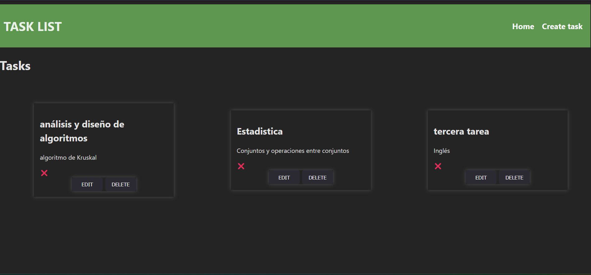

# mernStack
Web app using react and nodejs to build a task list project, connected with a DataBase to store all tasks

This is a simple project using nodejs to build the backend, react + vite to create the front end and endPoints, and mySql for Database

